---
## Front matter
title: "Отчёта по лабораторной работе 9"
subtitle: "Программирование цикла. Обработка аргументов командной строки."
author: "Эллина Майзингер	НММбд-02-22"

## Generic otions
lang: ru-RU
toc-title: "Содержание"

## Bibliography
bibliography: bib/cite.bib
csl: pandoc/csl/gost-r-7-0-5-2008-numeric.csl

## Pdf output format
toc: true # Table of contents
toc-depth: 2
lof: true # List of figures
lot: true # List of tables
fontsize: 12pt
linestretch: 1.5
papersize: a4
documentclass: scrreprt
## I18n polyglossia
polyglossia-lang:
  name: russian
  options:
	- spelling=modern
	- babelshorthands=true
polyglossia-otherlangs:
  name: english
## I18n babel
babel-lang: russian
babel-otherlangs: english
## Fonts
mainfont: PT Serif
romanfont: PT Serif
sansfont: PT Sans
monofont: PT Mono
mainfontoptions: Ligatures=TeX
romanfontoptions: Ligatures=TeX
sansfontoptions: Ligatures=TeX,Scale=MatchLowercase
monofontoptions: Scale=MatchLowercase,Scale=0.9
## Biblatex
biblatex: true
biblio-style: "gost-numeric"
biblatexoptions:
  - parentracker=true
  - backend=biber
  - hyperref=auto
  - language=auto
  - autolang=other*
  - citestyle=gost-numeric
## Pandoc-crossref LaTeX customization
figureTitle: "Рис."
tableTitle: "Таблица"
listingTitle: "Листинг"
lofTitle: "Список иллюстраций"
lotTitle: "Список таблиц"
lolTitle: "Листинги"
## Misc options
indent: true
header-includes:
  - \usepackage{indentfirst}
  - \usepackage{float} # keep figures where there are in the text
  - \floatplacement{figure}{H} # keep figures where there are in the text
---

# Цель работы

Целью работы является приобретение навыков написания программ с использованием циклов и обработкой аргументов командной строки..

# Задание

1. Изучите примеры программ

2.  Напишите программу, которая находит сумму значений функции f(x) для x = x1, x2
, ..., xn, т.е. программа должна выводить значение f(x1) + f(x2)+...+f(xn). Значения x передаются как аргументы. Вид функции f(x)
выбрать из таблицы 9.1 вариантов заданий в соответствии с вариантом, полученным при выполнении лабораторной работы № 7. Создайте исполняемый файл и проверьте его работу на нескольких наборах x.

3. Загрузите файлы на GitHub.

# Выполнение лабораторной работы

1. Создадим каталог для программам лабораторной работы № 9, перейдем в
него и создадим файл lab9-1.asm

2. Введем в файл lab9-1.asm текст программы из листинга 9.1. 
Создадим исполняемый файл и проверим его работу. (рис. [-@fig:001], [-@fig:002])

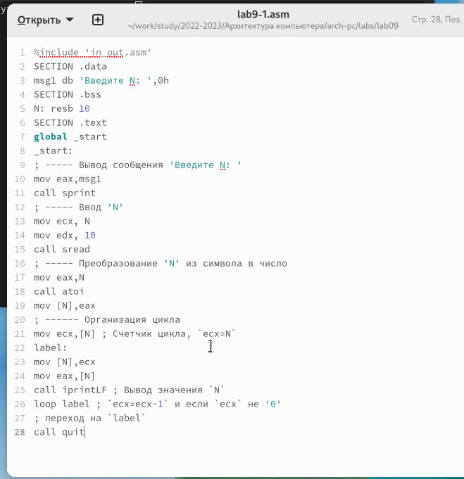{ #fig:001 width=70%, height=70% }

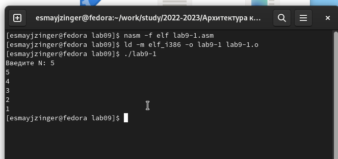{ #fig:002 width=70%, height=70% }

3. Данный пример показывает, что использование регистра ecx в теле цилка
loop может привести к некорректной работе программы. Изменим текст программы, добавив изменение значение регистра ecx в цикле:
Создадим исполняемый файл и проверим его работу. (рис. [-@fig:003], [-@fig:004])

В данном случае программа запускает бесконечный цикл.

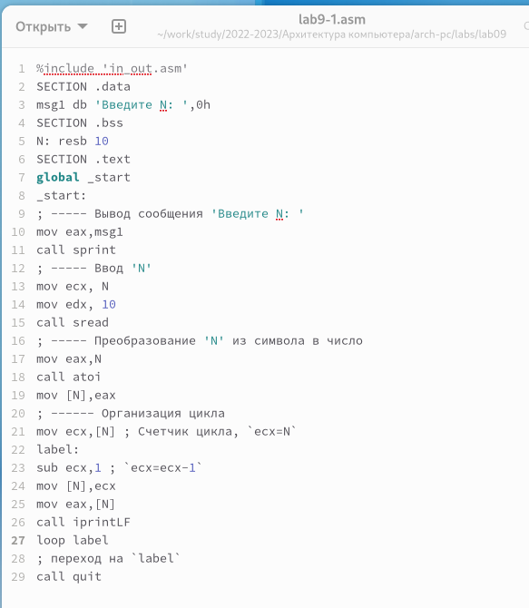{ #fig:003 width=70%, height=70% }

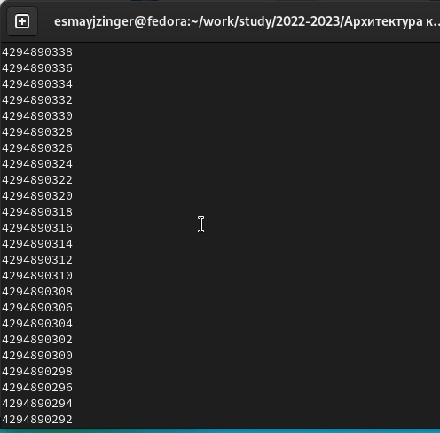{ #fig:004 width=70%, height=70% }

4. Для использования регистра ecx в цикле и сохранения корректности работы
программы можно использовать стек. Внесем изменения в текст программы,
добавив команды push и pop (добавления в стек и извлечения из стека) для
сохранения значения счетчика цикла loop. Создадим исполняемый файл и проверим его работу. 
(рис. [-@fig:005], [-@fig:006])

В данном случае программа выводит числа от N-1 до 0, что соотвтствует числу проходов цикла, введенному с клавиатуры.

{ #fig:005 width=70%, height=70% }

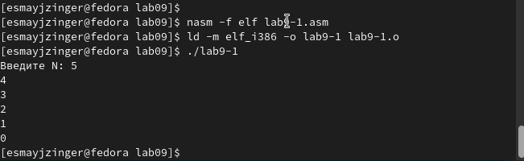{ #fig:006 width=70%, height=70% }

5. Создадим файл lab9-2.asm в каталоге ~/work/arch-pc/lab09 и введите в него
текст программы из листинга 9.2.
Создадим исполняемый файл и запустим его, указав аргументы. (рис. [-@fig:007], [-@fig:008])

Эта программа обработала 5 аргументов.

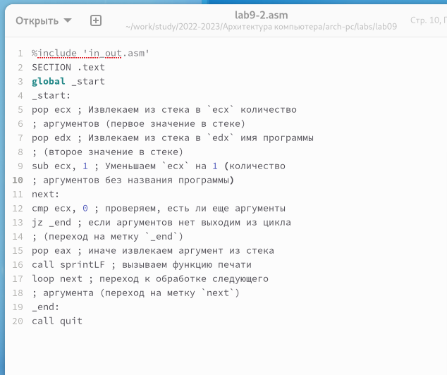{ #fig:007 width=70%, height=70% }

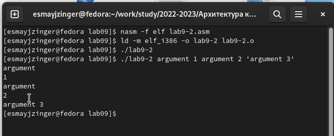{ #fig:008 width=70%, height=70% }

6. Рассмотрим еще один пример программы которая выводит сумму чисел,
которые передаются в программу как аргументы. (рис. [-@fig:009], [-@fig:010])

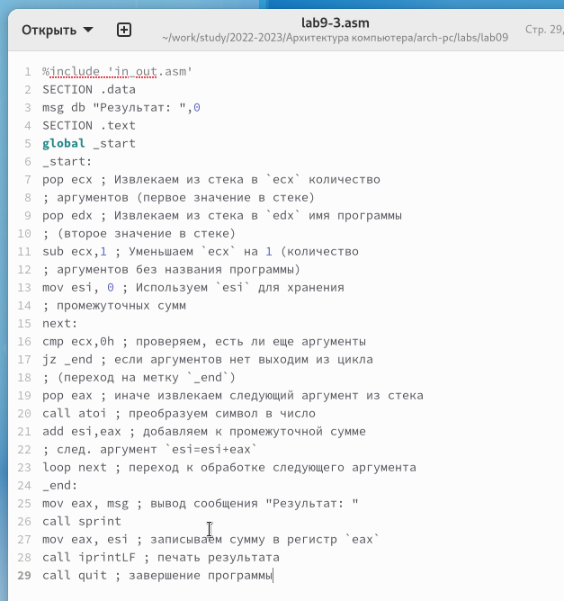{ #fig:009 width=70%, height=70% }

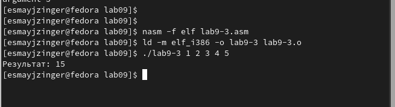{ #fig:010 width=70%, height=70% }

7. Изменим текст программы из листинга 9.3 для вычисления произведения
аргументов командной строки. (рис. [-@fig:011], [-@fig:012])

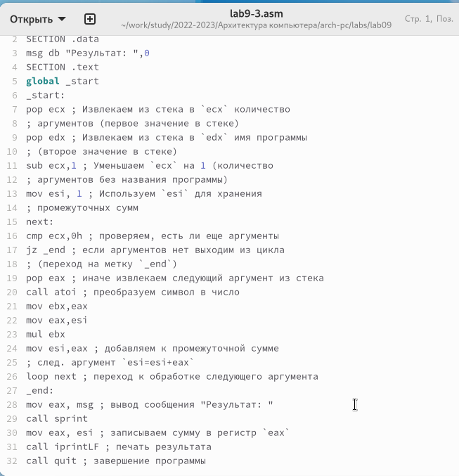{ #fig:011 width=70%, height=70% }

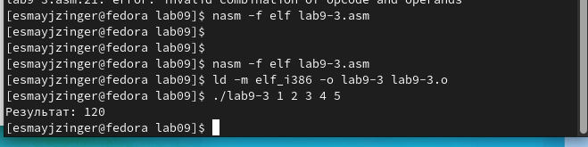{ #fig:012 width=70%, height=70% }

8. Напишем программу, которая находит сумму значений функции f(x) для x = x1, x2
, ..., xn, т.е. программа должна выводить значение f(x1) + f(x2)+...+f(xn). Значения x передаются как аргументы. Вид функции f(x)
выберем из таблицы 9.1 вариантов заданий в соответствии с вариантом, 
полученным при выполнении лабораторной работы № 7 (10 вариант). 
Создадим исполняемый файл и проверим его работу на нескольких наборах x.
(рис. [-@fig:013], [-@fig:014])

для варивнта 10 f(x) = 5(2+x)

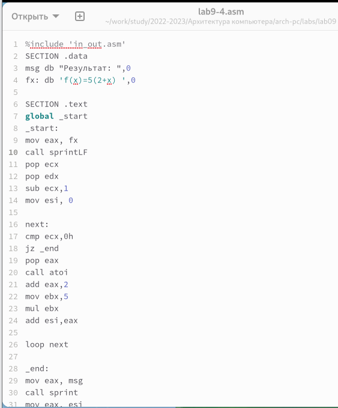{ #fig:013 width=70%, height=70% }

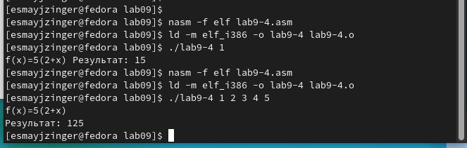{ #fig:014 width=70%, height=70% }

# Выводы

В время выполнения лабораторной работы была освоена работа со стеком, циклом и аргументами на ассемблере nasm.

